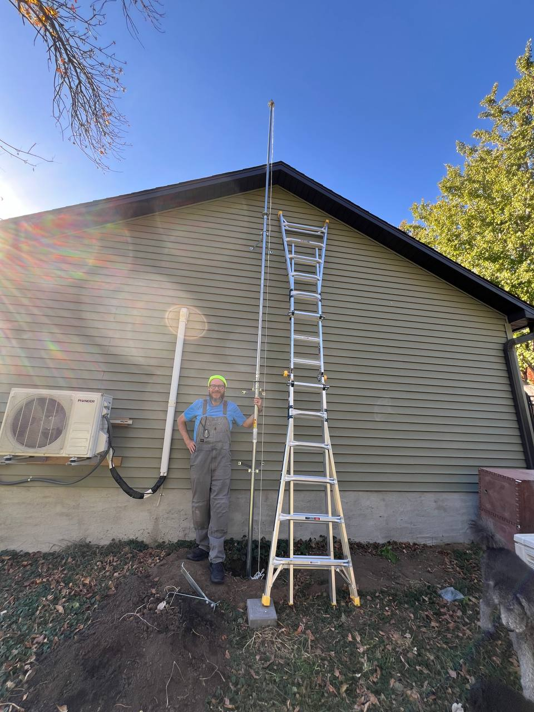
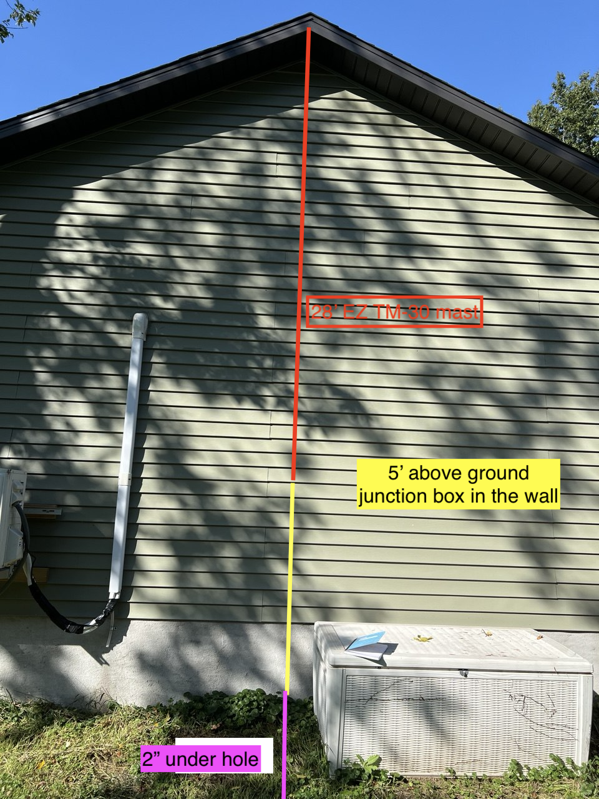

Slowly putting up an antenna mast up on the east wall of our detached garage.

Here is a picture of the outer garage wall:

Note!  The total length of the [EZ TM-30 mast](https://easyupinc.com/wp-content/uploads/2024/06/Spec-Sheet-EZ-TM-30.pdf) is 28'.   28' is not the length of the red line in the picture above.

Update: 2025 Nov 05

