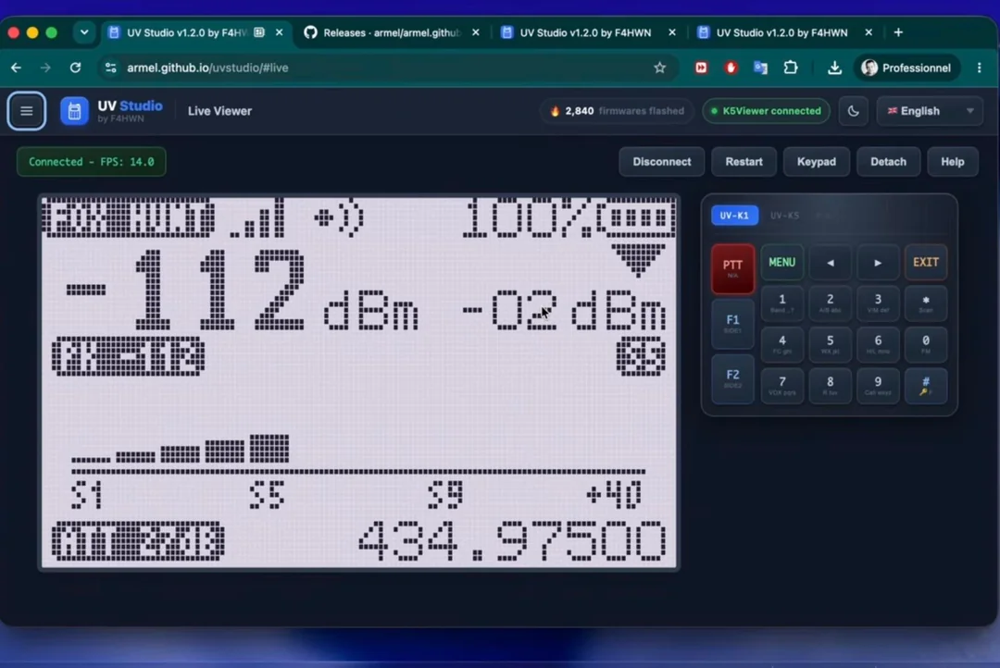

Last month [Aaron](https://www.grothe.us/presentations/) gave a talk on [Alternative Radio Firmwares](Alternative Radio Firmwares).   On Thursday, at the pub, I installed [F4HWN firmware port for the UV-K1 and UV-K5 V3 using the PY32F071 MCU](https://github.com/armel/uv-k1-k5v3-firmware-custom) which works with the [QUANSHENG UV-K5 v3](https://www.amazon.com/dp/B0CB8XXBH4) $28 hand held radio.  I'm very excited and curious to try out [Fox Hunt Mode](https://www.reddit.com/r/F4HWN/comments/1vdwzwn/fusion_580_fox_hunt/).

