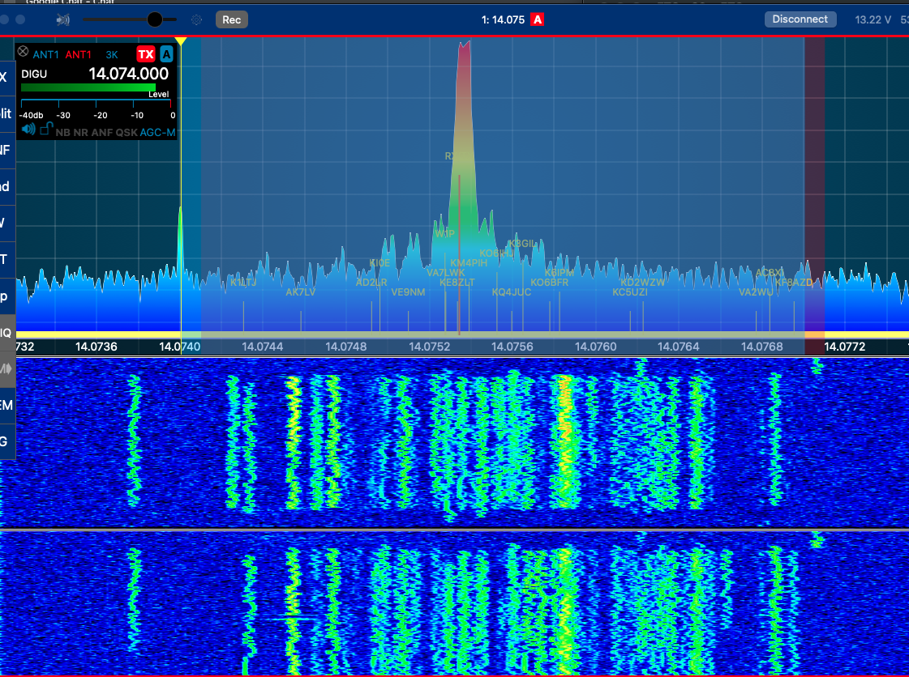
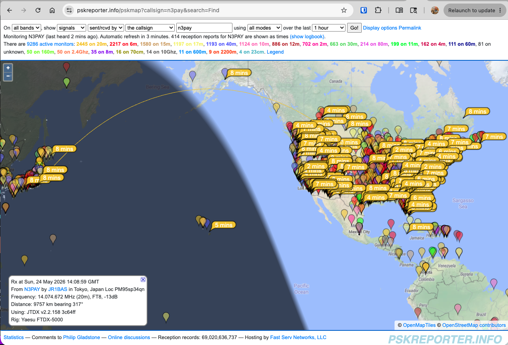
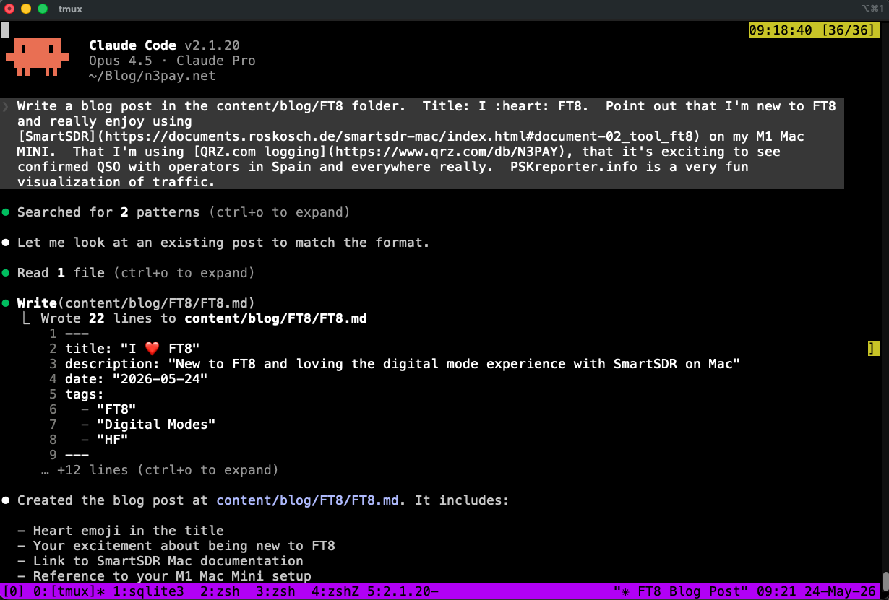

I'm new to FT8 and I'm really enjoying it!

<a href="https://github.com/payne/myQRZlogs">My QSO logs have been growing
   
</a>

I've been using [SmartSDR](https://documents.roskosch.de/smartsdr-mac/index.html#document-02_tool_ft8) on my M1 Mac Mini and it's been a great experience. The integration is smooth and makes getting on the air with FT8 straightforward.

For logging, I'm using [QRZ.com](https://www.qrz.com/db/N3PAY). It's exciting to see confirmed QSOs showing up in my logbook with operators from Spain and really everywhere around the world. There's something special about making contacts across the globe with low power digital modes.

If you haven't checked it out yet, [PSKreporter.info](https://pskreporter.info/) is a very fun visualization of FT8 traffic. You can see your signal being received in real-time across the map - it's fascinating to watch your transmissions propagate.

73!

p.s. this blog post was written with this claude.ai prompt:

