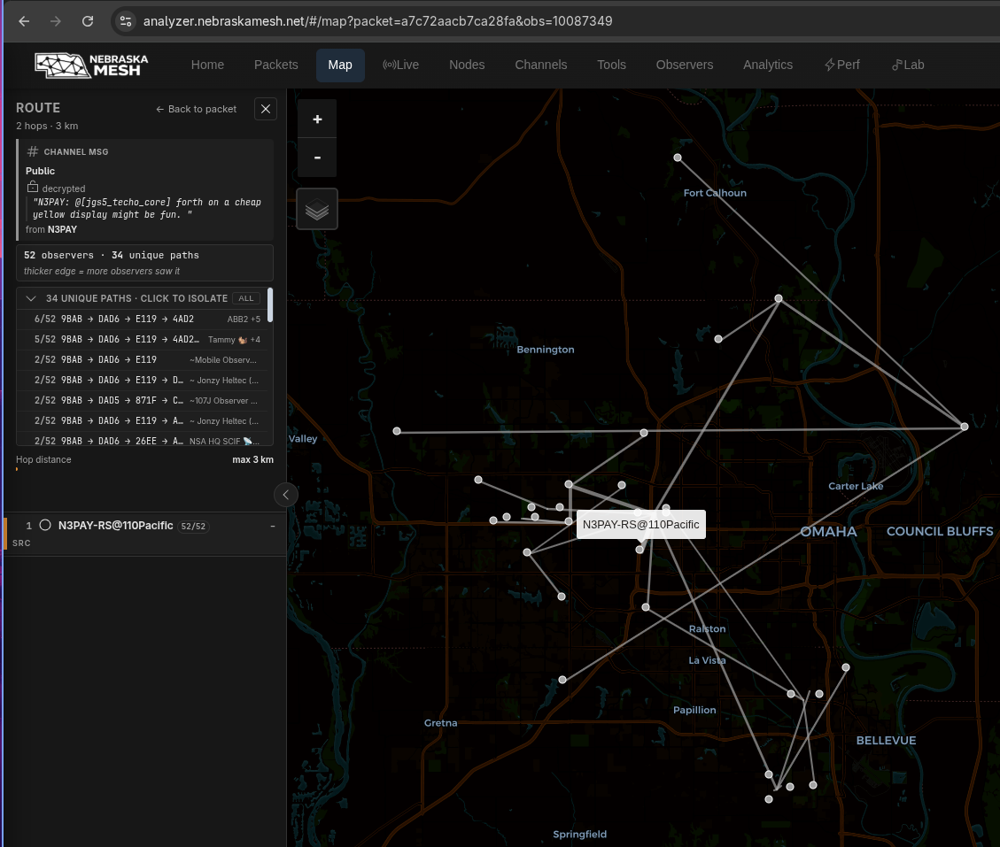
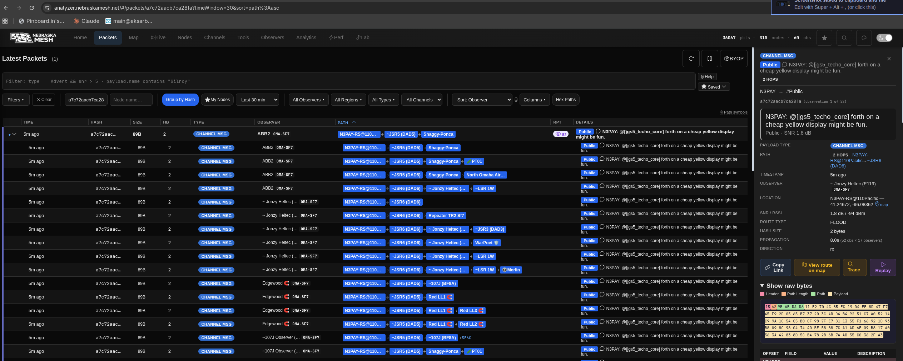

[MeshCore](https://meshcore.io/) is fun.  No HAM radio license required. James W8ING and folks from NebraskaMesh.net did a wonderful job talking about MeshCore and NebraskaMesh.net at BARC in August 2026.  Several of us bought equipment.  I copied Dennis KC0YKN and Tim KF0TIA when I bought my [Seeed Studio Wio Tracker L1 Pro MeshCore LoRa Companion, OLED, 2000mAh](https://www.amazon.com/dp/B0H2GRDBFL).   I'm able to sit in my basement, send a message with the MeshCore app on my iPhone to the Wio that's upstairs.  From there it goes to my [SenseCAP P1 Pro Solar Node](https://amzn.to/45UZwSZ) configured as a [room server that is also acting as a repeater](https://www.youtube.com/watch?v=8ABGCAx8Oig&t=48s).  Then it spreads throughout the mesh.  

Both the above screen grab and the one below are from [https://analyzer.nebraskamesh.net](https://analyzer.nebraskamesh.net/#/live) an awesome open source program called [CoreScope](https://github.com/Kpa-clawbot/CoreScope/).  

Through CoreScope each node has a unique URL.  My solar powered SenseCAP P1 Pro node is room server [N3PAY-RS@110Pacific](https://analyzer.nebraskamesh.net/#/nodes/9bab4813a3482208eab4cd51d475d091882e236e0336ae41725b9cc184ec9e06).  

## Area HAMs using MeshCore 

I was able to have Claude scrape a node names into a SQLite database.  Because [NebraskaMesh.net suggests HAMs put their callsigns](https://www.nebraskamesh.net/help.html#naming-scheme) in their node names, you can view the list of area nodes using call signs in their names here: [https://payne.github.io/NebraskaMeshScraping/ham.html](https://payne.github.io/NebraskaMeshScraping/ham.html).  It even lets you play with the database using WASM and [Datasette Lite](https://github.com/simonw/datasette-lite).

## My favorite YouTube Playlist on MeshCore

This playlist about MeshCore is great: [YouTube's The Comms Channel](https://www.youtube.com/playlist?list=PLshzThxhw4O4WU_iZo3NmNZOv6KMrUuF9).  I really like that YouTube channel.

## Asked Claude "Start a blog entry about MeshCore and NebraskaMesh" and it generated the rest of this blog post.

[MeshCore](https://github.com/meshcore-dev/MeshCore) is a lightweight, hybrid-routing mesh protocol for LoRa packet radios.  [Nebraska Mesh](https://www.nebraskamesh.net/) is a volunteer-run MeshCore network spanning Nebraska: no internet, no cell towers, just neighbors keeping neighbors connected.  It started around Omaha ([OmaMesh](https://omamesh.net/)) and has spread to Lincoln, Grand Island, and rural counties.

## Radio settings

Nebraska Mesh uses these settings:

| Setting | Value |
| --- | --- |
| Frequency | 910.525 MHz |
| Bandwidth | 62.5 kHz |
| Spreading Factor | 7 |
| Coding Rate | 8 |

## Firmware types

MeshCore has four firmware types:
1. Companion Radio — pairs with a phone app
1. Repeater — typically used for Nebraska Mesh infrastructure
1. Room Server
1. T-Deck/T-Pager

<!-- TODO: which hardware I'm using and which firmware I flashed -->

## Watching the mesh

I've been [scraping](https://github.com/payne/NebraskaMeshScraping) to watch MeshCore activity in the Nebraska bounding box.  The [NebraskaMesh Analyzer](https://analyzer.nebraskamesh.net/) is another great way to see what's happening on the network.

## Links

1. [Nebraska Mesh](https://www.nebraskamesh.net/) — [About](https://www.nebraskamesh.net/about.html), [Help & Documentation](https://www.nebraskamesh.net/help.html)
1. [NebraskaMesh Analyzer](https://analyzer.nebraskamesh.net/)
1. [OmaMesh](https://omamesh.net/) — Omaha Mesh Networking
1. [Nebraska Mesh on MeshCore Ninja](https://meshcore.ninja/network/nebraska-mesh/)
1. [MeshCore on GitHub](https://github.com/meshcore-dev/MeshCore)

