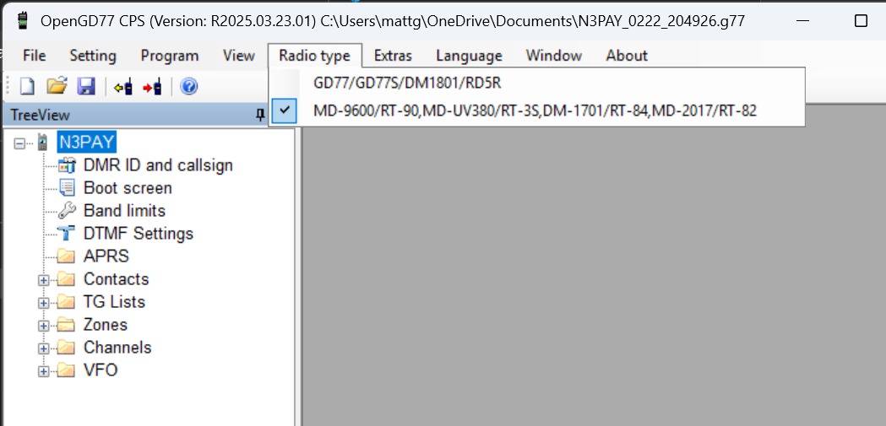
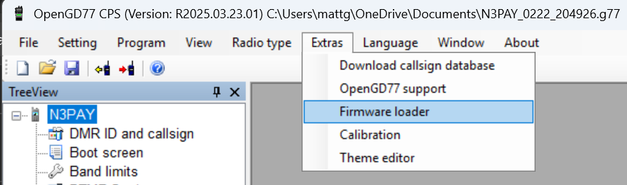
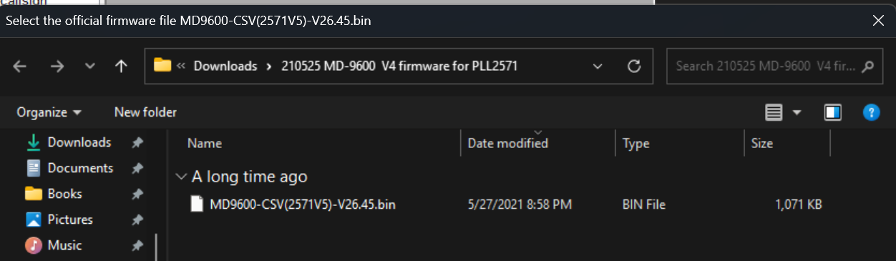
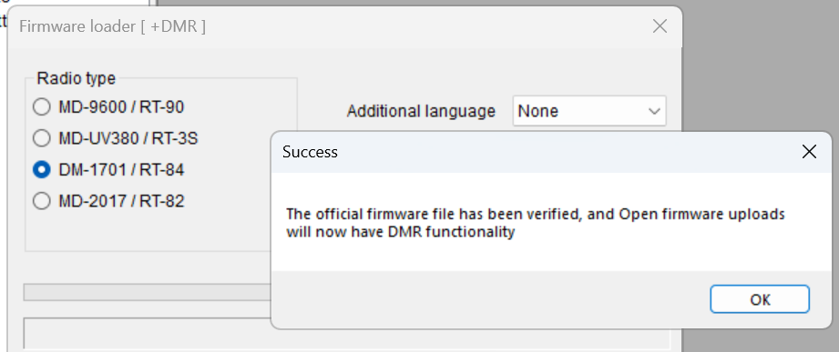
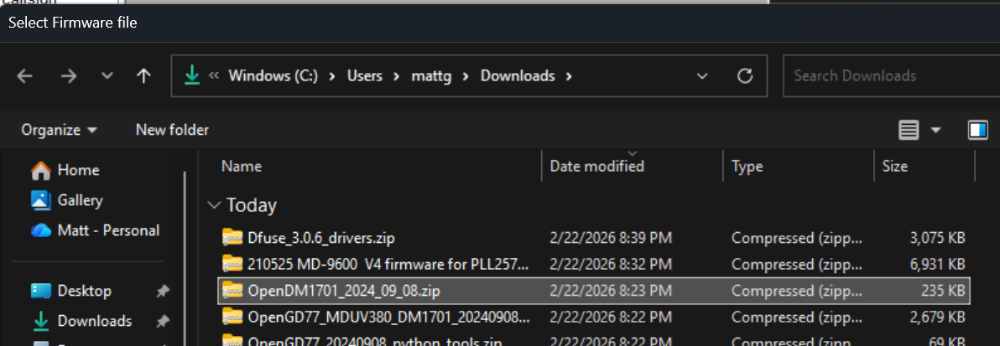
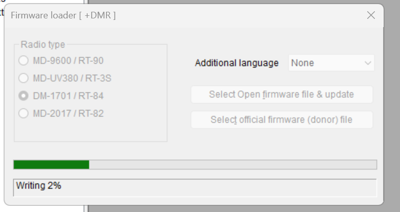
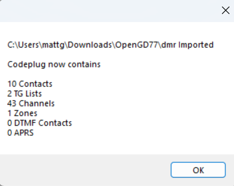
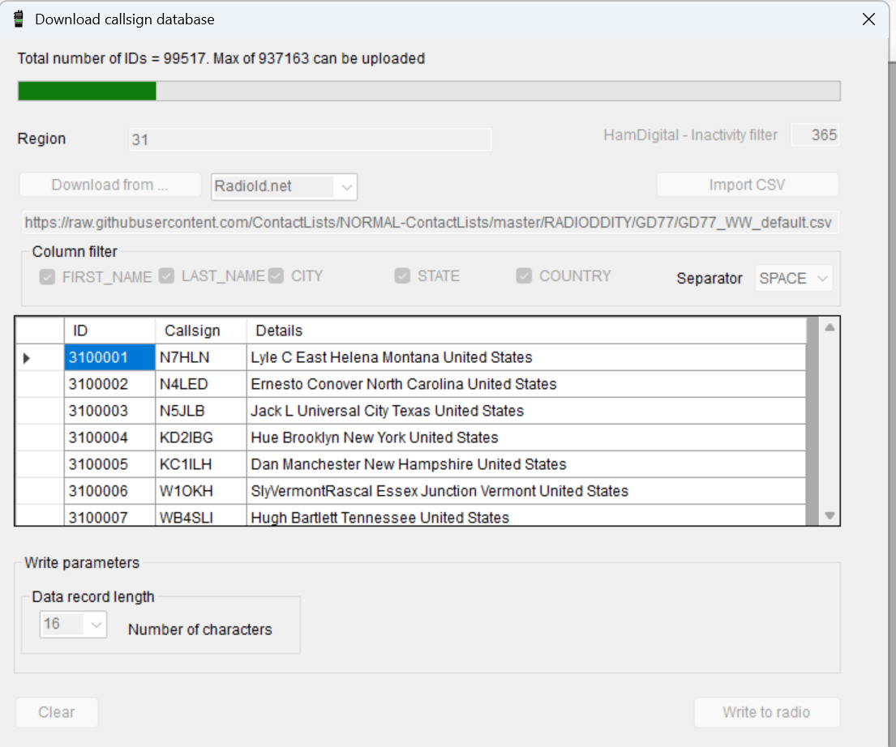

Put the radio in DFU mode.  [This YouTube from HAMTech Radio Scanner M0FXB](https://youtu.be/qxQhUp99Pik?si=vqciClA7hdqDM6Rr) talks about how to put the DM-1701 in DFU mode.  Off, hold PTT and button above it, then turn on radio and notice the flashing led.

File import CSV 

