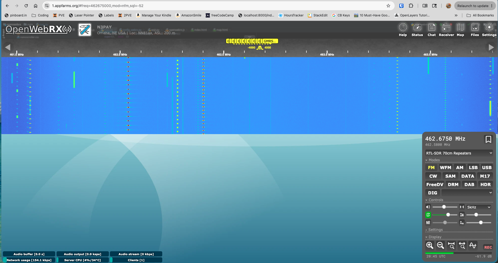

# Free to use instance of OpenWebRX+ in my garage

* [Slides about my setup](https://docs.google.com/presentation/d/1YgTNU5ADHafpNjMX_soMgbGfOIlniAADUmTuxSM0Vzo/edit?usp=sharing)

you can see the cluster of yellow GMRS bookmarks in the top middle of 1.AppFarms.org.   You need to set it to the RTL-SDR 70cm Repeaters to get that.  I like to single click on SQ (just above NR in the lower right) to auto adjust then right click on SQ to make it scan.  It only scans on bookmarks.   Anyone with a gmail can get in and many people can use it at once.   Someday I'll find a better location for this listening setup because at home, whenever I transmit it [desenses](https://www.reddit.com/r/amateurradio/comments/16pfiro/could_someone_eli5_how_radio_desense_works/).  And I want to move it the More-Radio.org domain.

