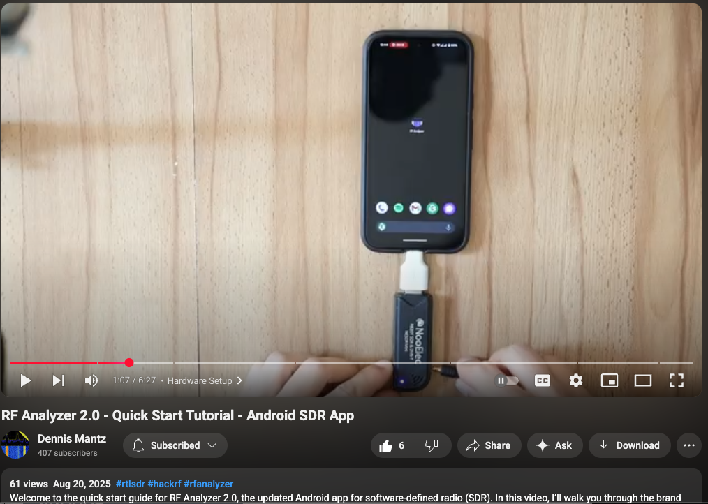

TIL there's an [open source](https://github.com/demantz/RFAnalyzer) [Android application called RF Analyzer](https://www.reddit.com/r/RTLSDR/comments/1mvm6nr/rf_analyzer_20_is_live_modern_android_sdr_app/) that works when you plug in a RTLSDR into a phone.  I have not tried it yet (I have an iPhone and a cheap android tablet).

## Adventures with RF Analyzer

When I do try this application, I hope to put some notes here.  Big dreams....

