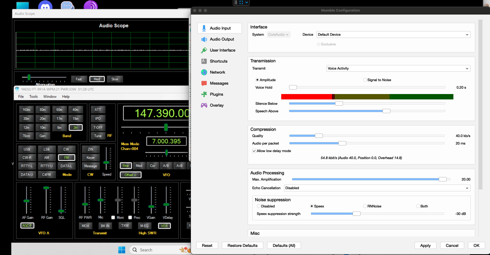
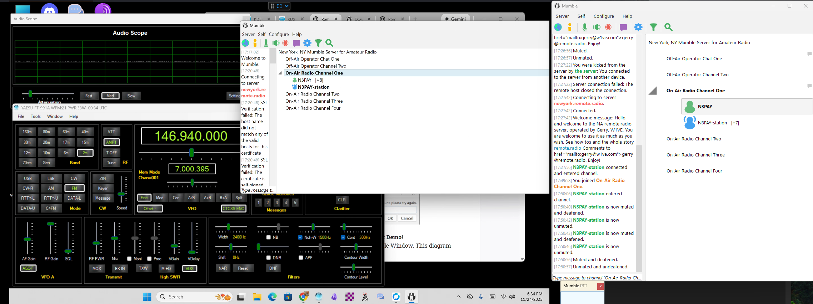

Finally got around to playing through the instructions at [Remote.Radio](https://Remote.Radio).  It's a well written website.

Tonight I'll attend the 8 pm BARC net with this setup:

One of my Elmers (suggested making VDelay almost a second) and now things are working swell.   My specific setup is:

```
FT-991A <<<---- USB --->>> Win 11 Pro <<<--- TCP --->>> M1 Mac Mini
```

The FT-991A and Win 11 Pro computer are in my cold garage.  My M1 Mac Mini is in my warm basement office.   In the coming weeks I hope to invite select HAM radio friends to try operating my FT-991A with this setup.

1. Win4Yaesu for nice GUI with CAT control $60 one time cost,
2. RustDesk for remote control -- free,
3. Mumble for audio -- free,
4. In the next few days I'll start using a private Mumble server for $10 / year ( mumble is open source and could be self hosted )

I'm able to attend my first NET with this setup and I think it might work great.   I hope to discuss it during the 2025 December 2 BARC TechNet.






### Random References about Remote Radio
1. [ARRL notes on Remote Radio](https://www.arrl.org/link-remote-control)
1. [RemoteRadio.com is a for pay service](https://www.remotehamradio.com/#pricing)
1. [Richard WB9CSP](https://www.qrz.com/db/WB9CSP) does some remote operating.  Sent him an email asking about it.  https://wb9csp.de/ used Remote Hams
1. [RemoteHams.com](https://remotehams.com/) is free!
   1. [Windows Software Downloads](http://download.remotehams.com/)
   1. http://download.remotehams.com/orb/RCForb_Client_Manual.pdf
	 1. Their [online remote base (ORB) software](https://www.remotehams.com/assets/pdfs/ORB_Control_Manual.pdf) dates back to 2014.  Nice!


