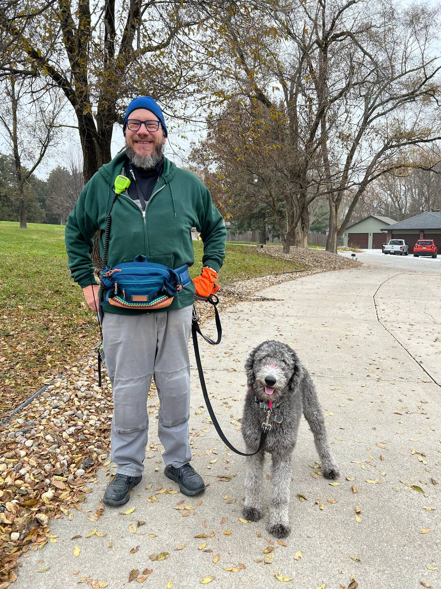

I was excited to hear [HRCC recommendations](https://youtu.be/iK-0CRMoxOU?si=GxxN0HtO7zhy9Ing) and bought a
[$20 speaker mic that works great](https://www.youtube.com/redirect?event=video_description&redir_token=QUFFLUhqbWF4aFEzUnlSSk9VeXcyNWY0WnhmWXJyeGxDd3xBQ3Jtc0tuR010R3JMcHpvMTNyN2I3dUlndjV3ekFPUmhuejNtVXRLRHh2bXRQblQ4N2hPbUFjeXduYTFCdGRKaGMtMmVTV3BYejBRUlpHa21peEdhNmpUWm8xZHZjQVVNNmUzTjVRZklNNnU3enZFX29PNHRFNA&q=https%3A%2F%2Famzn.to%2F483PoYW&v=iK-0CRMoxOU) with my TD-H3 VHF/UHF radio.  I'm going to get the [companion earpiece](https://www.amazon.com/dp/B01NAPDHAV) that plugs into a jack on the speaker mic.

In this photo of Yahtzee & me, I have my TD-H3 in side pocket on my leg and you can see how handy the microphone is -- I did not need to un-clip it to chat.

