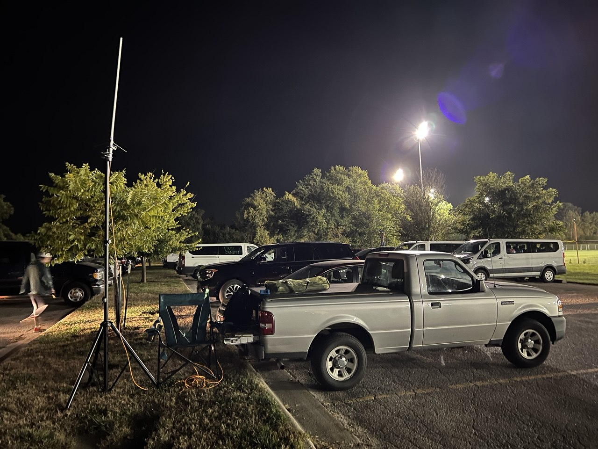
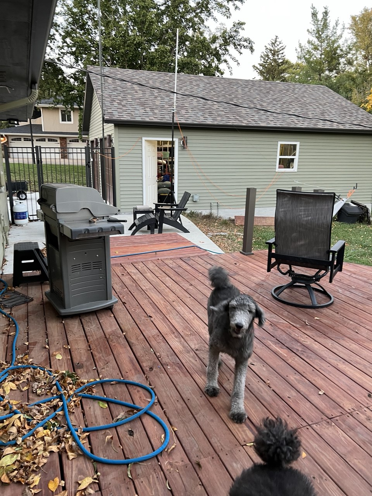

Putting an antenna atop a speaker stand is an idea I learned from folks in [BARC](http://localhost:8080/clubs/barc/).

The setup is not small, but it fits in my small 2011 Ford Ranger:

I'm very pleased that I can reach the Bellevue repeater from my house using this.  I've not yet tested this on a day with bad weather.

