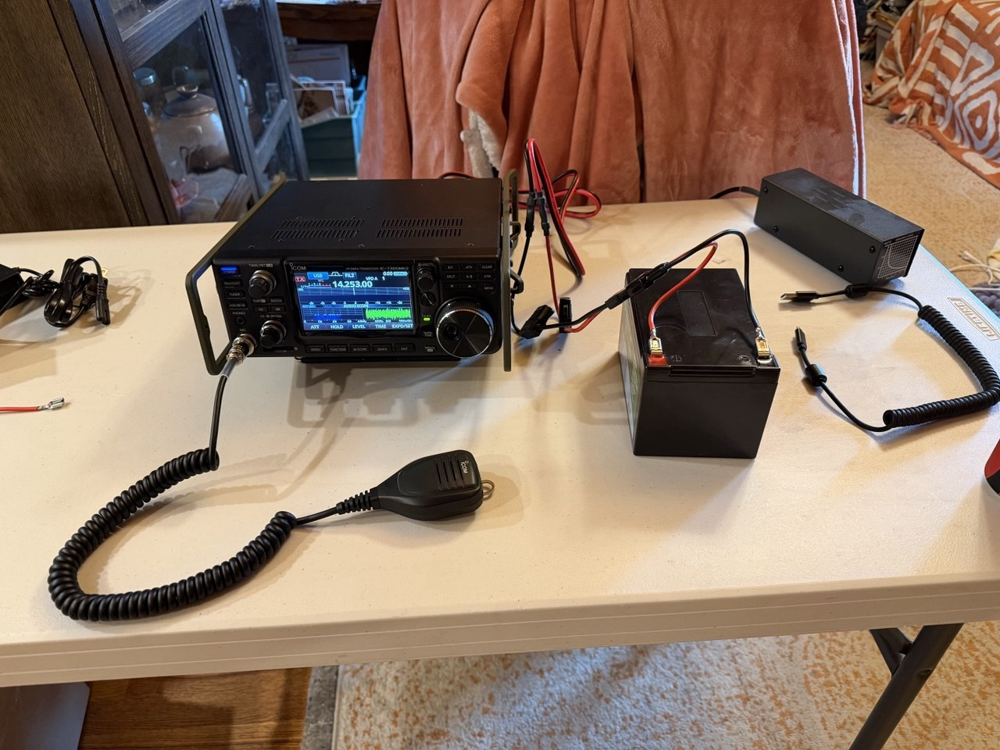
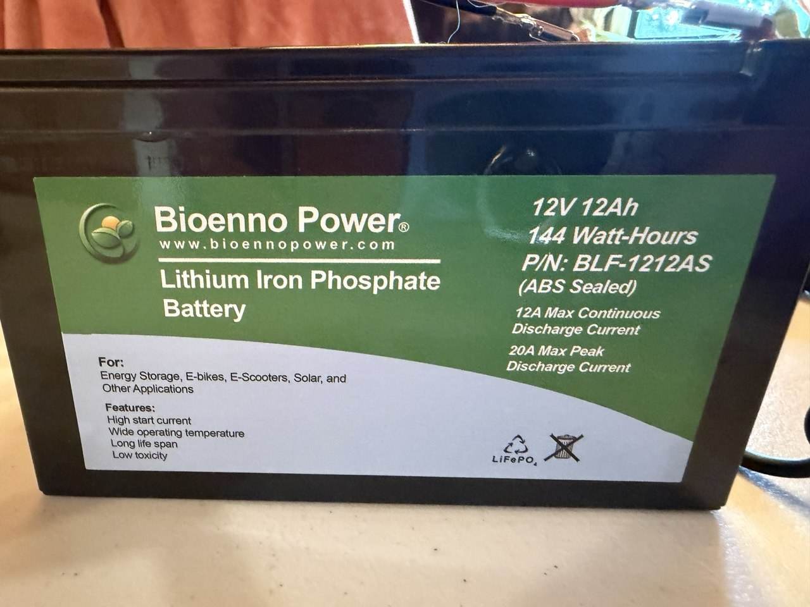

I'm hoping to start activating parks soon by using my ICOM 7300 Mk2 radio and some Bioenno batteries along with a JPC-12 antenna. While I have a [POTA profile](https://pota.app/#/profile/N3PAY) and a very good friend tried to help me activate a park once, I am completely new to this world. For example connecting the anderson power poles lead to the spade connectors on my battery was difficult (for me). It reminded me of when computer mice started to become popular and people would struggle with them for the first time. I'm sure there will be many things I'll struggle with learning and practicing POTA activations. Please help me? I'll pay it forward... just like that time I learned to use a computer mouse in the 1980s.

