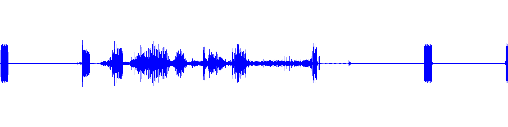

This morning, while listening to a great conversation on the local VHF repeater I heard someone interject a good piece of advice sternly said: "Watch your language."  [Listen to the audio](watch-your-language.mp3)



The waveform image above was generated using ffmpeg:

```bash
ffmpeg -i watch-your-language.mp3 -filter_complex "showwavespic=s=1920x480:colors=blue" -frames:v 1 watch-your-language-waveform.png -y
```
