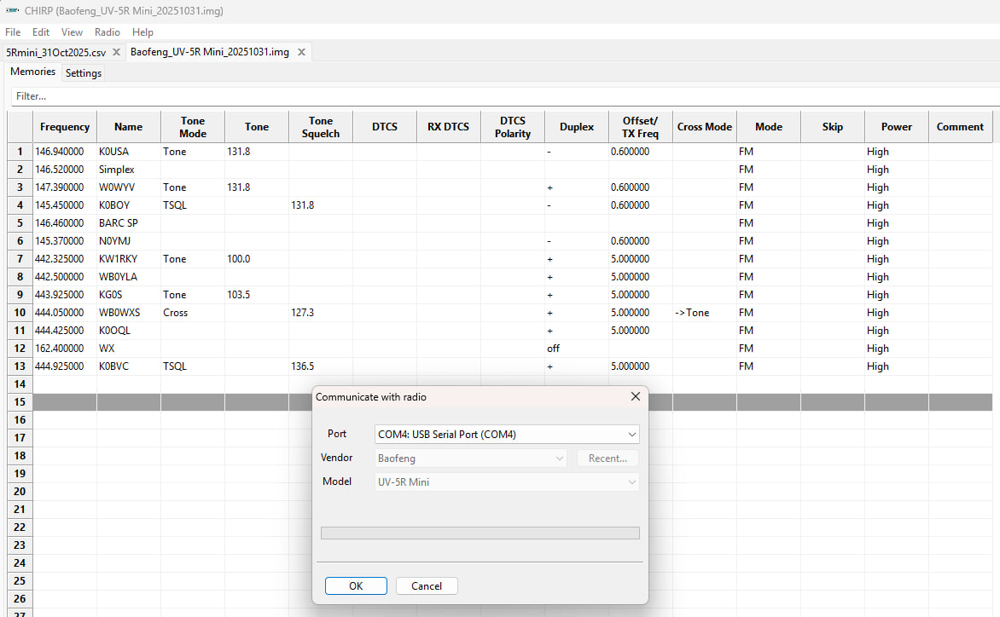

I'm liking [CHIRP](https://chirpmyradio.com/projects/chirp/wiki/Home).

I was able to download [chirp csv file](5Rmini_31Oct2025.csv) based on my the setup I'd done with my TD-H3 on [Odmaster web](https://web.odmaster.net/login).  The read from the UV-5R radio with chirp and paste in that CSV file then write it back out to the radio.  Is it good that results in a [Baofeng_UV-5R Mini_20251031.img](Baofeng_UV-5R Mini_20251031.img) file?

