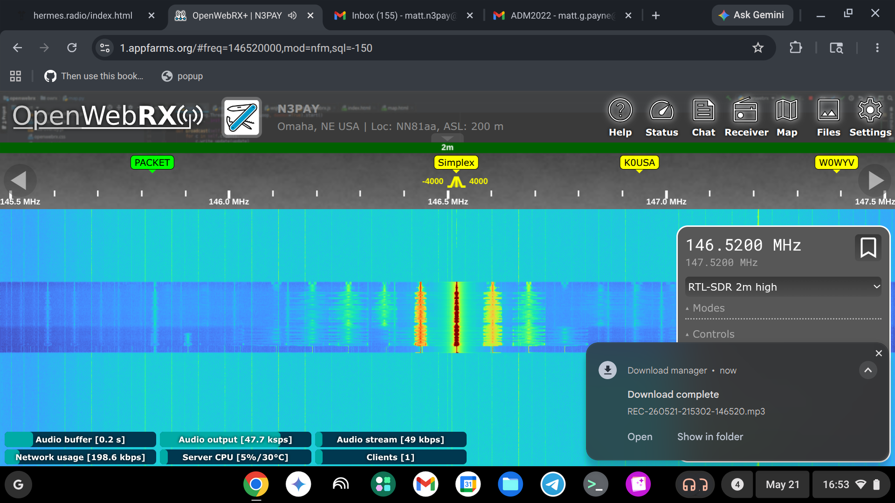
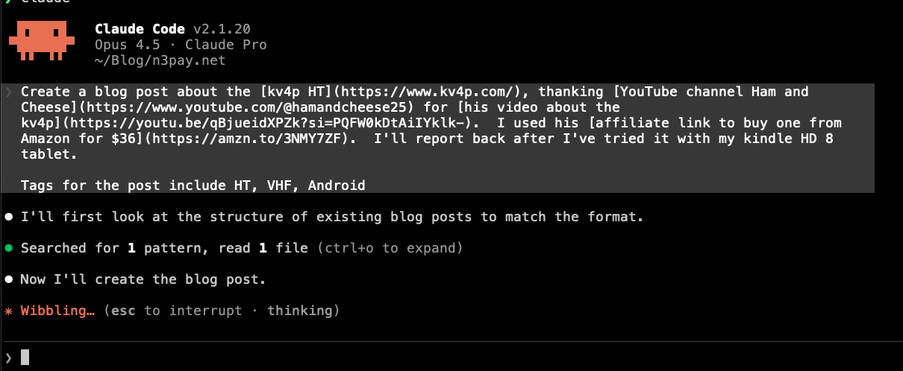

I recently learned about the [kv4p HT](https://www.kv4p.com/), an interesting device that turns your Android phone or tablet into a VHF transceiver.

Thanks to [Ham and Cheese on YouTube](https://www.youtube.com/@hamandcheese25) for [his video about the kv4p](https://youtu.be/qBjueidXPZk?si=PQFW0kDtAiIYklk-) that introduced me to this project. I used his [affiliate link to buy one from Amazon for $36](https://amzn.to/3NMY7ZF).

I'll be testing it with my Kindle Fire HD 8 tablet and will report back with my experience.

REPORT: Was able to transmit!  More details later.  Here is a sample of [the audio as recieved by my RTL-SDR](rec.mp3).  And what [my OpenWebRX+](https://1.AppFarms.org) looked like when receiving.

p.s. I vibe code this post like so:

